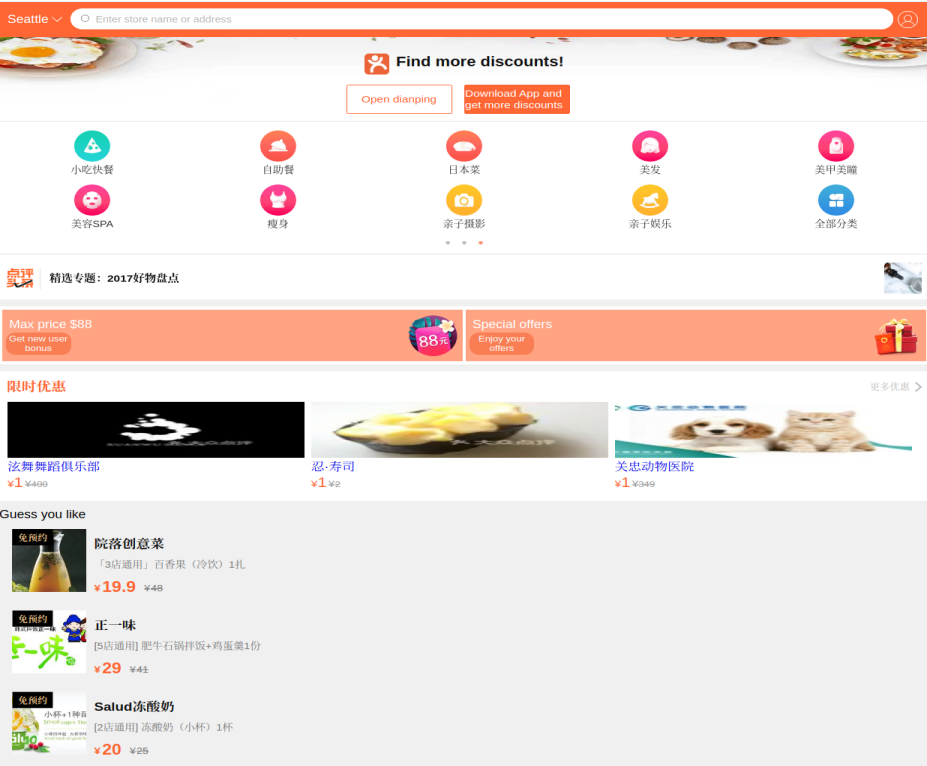
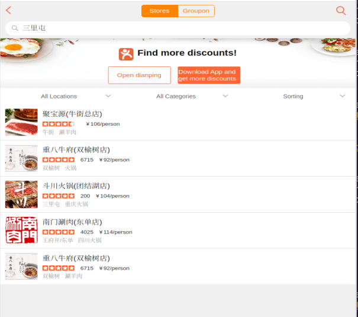
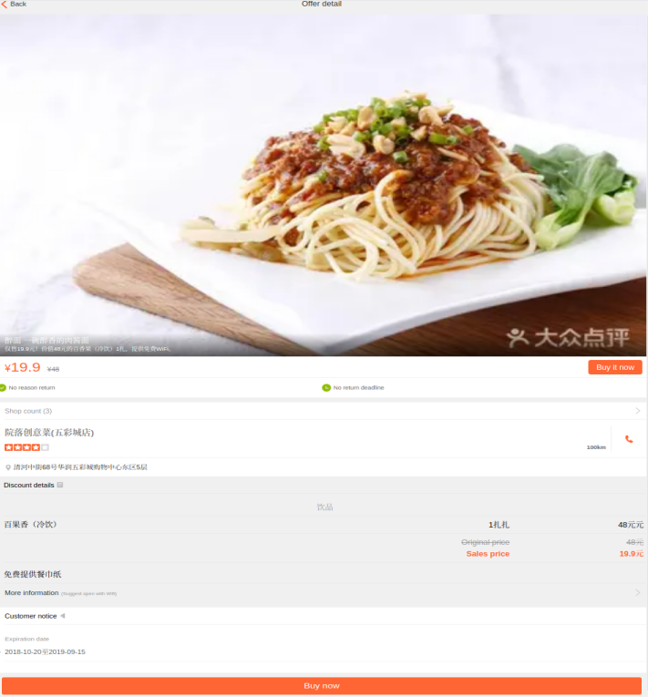
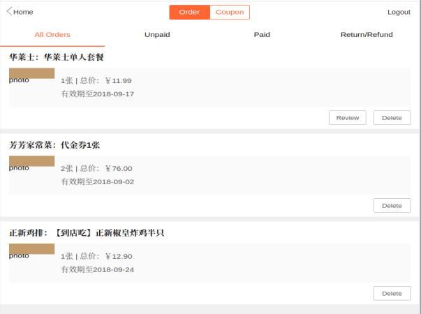

[![Contributors][contributors-shield]][contributors-url]
[![Forks][forks-shield]][forks-url]
[![Stargazers][stars-shield]][stars-url]
[![Issues][issues-shield]][issues-url]
[![MIT License][license-shield]][license-url]


<br/>
<p align="center">
  <h1 align="center">react-dianping-clone</h1>
</p>


<details open="open">
  <summary>Table of Contents</summary>
  <ol>
    <li>
      <a href="#about-the-project">About The Project</a>
      <ul>
        <li><a href="#components">Components</a></li>
        <li><a href="#built-with">Built With</a></li>
      </ul>
    </li>
    <li><a href="#requirements">Requirements</a></li>
    <li><a href="#how-to-run">How to Run</a></li>
    <li><a href="#usage">Usage</a></li>
    <li><a href="#license">License</a></li>
    <li><a href="#contact">Contact</a></li>
  </ol>
</details>


<br />

## About The Project

<h4>This repository contains the source code that simulates the UI of Dianping food delivery mobile app. It is not intended to create any kind of Dianping competitors, but to practice some advanced concepts in frontend development such as React, React-Router, and Redux. Just see it as a nice educational project that will help you to improve your coding skills.</h4>
<br/>

<br/>
<br/>


## Components
- Home
- Orders
- Checkout
- Search

## Built With
* [React.js](https://reactjs.org/)
* [create-react-app](https://github.com/facebook/create-react-app)
* [React Router](https://reactrouter.com/)
* [Redux Thunk](https://github.com/reduxjs/redux-thunk)
* [Redux](https://redux.js.org/)
* [reselect](https://www.npmjs.com/package/reselect)

<br/>

## Requirements
- npm
- Git
- React.js

## How to Run 
    ```sh
    git clone https://github.com/cutePanda123/react-dianping-clone.git
    cd react-dianping-clone
    npm install
    npm run
    ```

* Tools for development and testing:
  * [VS Code](https://code.visualstudio.com/)
  * [React Developer Tools Chrome extension](https://chrome.google.com/webstore/detail/react-developer-tools/fmkadmapgofadopljbjfkapdkoienihi?hl=en)
<br />

## Usage

* Home View
  <br/>
  <br/>
  
  <br/>
  <br/>
* Search View
  <br/>
  <br/>
  
  <br/>
  <br/>
* Checkout View
  <br/>
  <br/>
  
  <br/>
  <br/>
* Order History View
  <br/>
  <br/>
  
  <br/>
  <br/>
## License

Distributed under the MIT License. See `LICENSE` for more information.

<br/>

## Contact
Project Link: [https://github.com/cutePanda123/react-dianping-clone](https://github.com/cutePanda123/react-dianping-clone)


<!-- MARKDOWN LINKS & IMAGES -->
<!-- https://www.markdownguide.org/basic-syntax/#reference-style-links -->
[contributors-shield]: https://img.shields.io/github/contributors/cutePanda123/react-dianping-clone.svg?style=for-the-badge
[contributors-url]: https://github.com/cutePanda123/react-dianping-clone/graphs/contributors
[forks-shield]: https://img.shields.io/github/forks/cutePanda123/react-dianping-clone.svg?style=for-the-badge
[forks-url]: https://github.com/cutePanda123/react-dianping-clone/network/members
[stars-shield]: https://img.shields.io/github/stars/cutePanda123/react-dianping-clone.svg?style=for-the-badge
[stars-url]: https://github.com/cutePanda123/react-dianping-clone/stargazers
[issues-shield]: https://img.shields.io/github/issues/cutePanda123/react-dianping-clone.svg?style=for-the-badge
[issues-url]: https://github.com/cutePanda123/react-dianping-clone/issues
[license-shield]: https://img.shields.io/github/license/cutePanda123/react-dianping-clone.svg?style=for-the-badge
[license-url]: https://github.com/cutePanda123/react-dianping-clone/blob/master/LICENSE.txt
